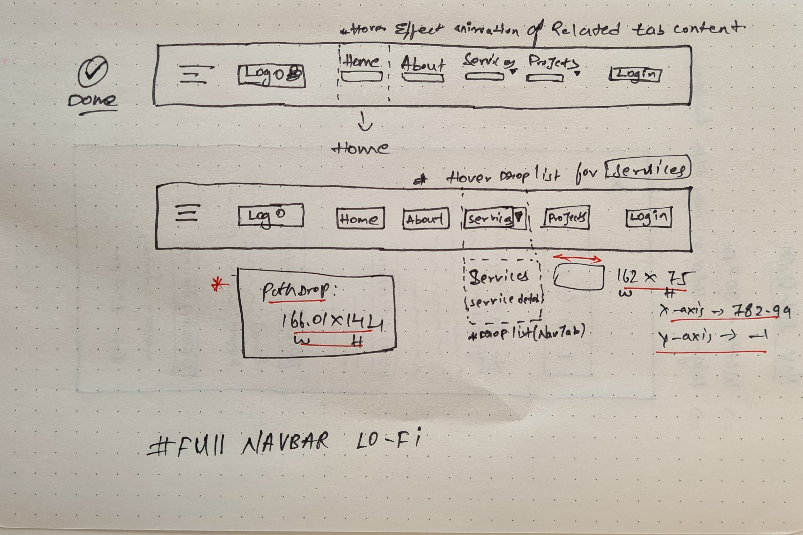
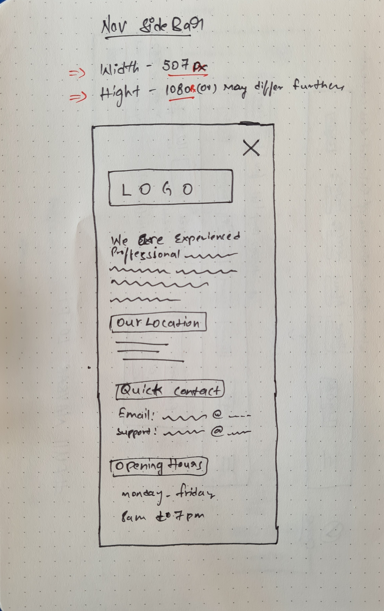

# WholoLot-Business-Project-2021

Designing a prototype for the wholeLot business website which is done with various techniques of wireframes low-fidelity and High-fidelity 

<h2>Low Fidelity wire frames</h2>
<h3>In this lo-fi wireframes we used the dotted grid book with finelines</h3>

note:

*The above prototype images of the home,login ovelay, Left-side bar(push left->right), about page, Footer.

*Modifcation can be done based on client requirement and complexity of tech tool's in the level of high fidelity prototype & source code development 

